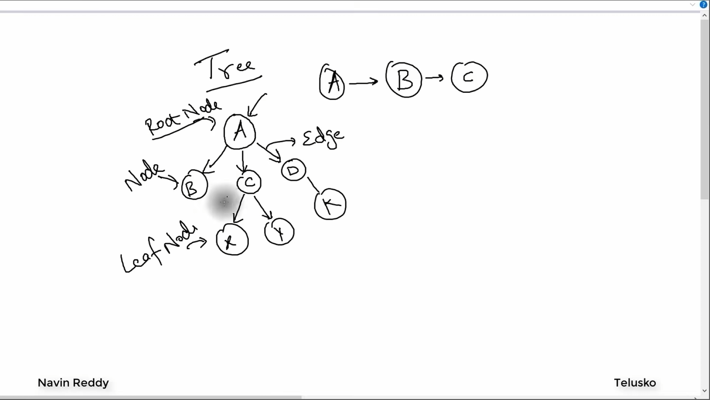

# $Trees$ $in$ $Java$

## $What$ $is$ $a$ $Trees$?

- A **Tree** is a hierarchical data structure that consists of nodes connected by edges. It is a non-linear structure that represents relationships between elements in a parent-child manner.
- Trees are widely used in various applications such as file systems, databases, and network routing.
- 
- Types of Binary Trees: 
  - **Binary Tree**: Each node has at most two children.
  - **Strict Binary Tree**: Each node has either 0 or 2 children.
  - **Full Binary Tree**: Every node other than the leaves has two children.
  - **Complete Binary Tree**: All levels are fully filled except possibly the last level, which is filled from left to right.
- `Height of a Tree/Node`: The height of a tree is the length of the longest path from the root node/selected node to a leaf node. It is measured in terms of the number of edges on that path.
- `Depth of a Node`: The depth of a node is the length of the path from the root node to that specific node. It is also measured in terms of the number of edges on that path.

## $Difference$ $Between$ $Binary$ $Tree$ $and$ $Binary$ $Search$ $Tree$?

- A **Binary Tree** is a tree data structure where each node can have at most two children, without any specific ordering of the nodes.
- A **Binary Search Tree (BST)** is a specialized type of binary tree that maintains a specific order: for each node, all values in the left subtree are less than the node's value, and all values in the right subtree are greater than the node's value. This property allows for efficient searching, insertion, and deletion operations.
- 

### $Traversals$ $in$ $Trees$

- In order: 
- Pre order: 
- Post order: 

## $How$ $to$ $Implement$ $a$ $Tree$ $in$ $Java$?

- In Java, a tree can be implemented using classes and objects. Each node in the tree can be represented as an instance of a class that contains data and references to its child nodes.
- The primary operations of a tree include:
  - `insert()`: Adds a new node to the tree.
  - `delete()`: Removes a node from the tree.
  - `traverse()`: Visits all nodes in the tree in a specific order (e.g., pre-order, in-order, post-order).
  - `search()`: Finds a node with a specific value in the tree.
  - `height()`: Returns the height of the tree.

## $Implementation$

- [See here](./IntroToTree.java) for a basic creation and implementation of a `Binary Search Tree` in Java with methods to add, remove, and display nodes.
