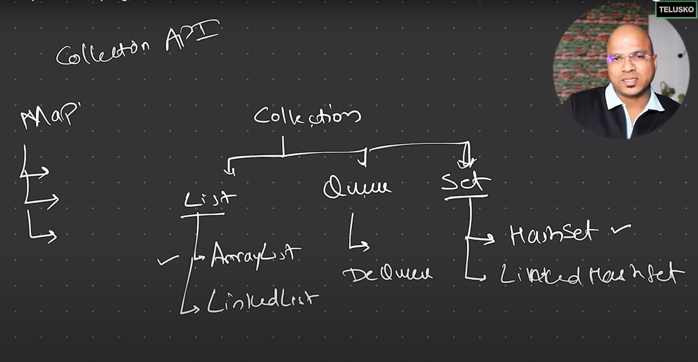

## What is Collection API?

- Collection is a **concept** in `Java`.

## What is Collection?

- Collection is an **Interface** in `Java`.

## What is Collection?

- Collection is a **Class** in `Java`.

